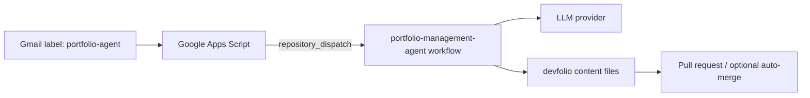

# portfolio-management-agent

Automation and orchestration for managing portfolio content in [`rprabhakar789/devfolio`](https://github.com/rprabhakar789/devfolio) from Gmail-triggered requests.

## Repository roles

- **`rprabhakar789/devfolio`** remains the portfolio site's source of truth.
- **`rprabhakar789/portfolio-management-agent`** contains Gmail bridge examples, orchestration logic, schemas, AI integration scripts, GitHub Actions workflows, fixtures, and documentation.

This repo never edits the portfolio site's application code. It only supports mutations to this exact allowlist in the target repo:

- `content/about.md`
- `content/experience.yaml`
- `content/projects.yaml`
- `content/education.yaml`
- `content/skills.yaml`
- `content/contact.yaml`

If a requested run would touch any other path, the workflow fails.

## Current target-repo gap

The current local `devfolio` checkout does **not** yet satisfy the content contract required by this automation:

- there is no top-level `content/` directory
- portfolio data is hardcoded inside React components under `src/components`
- there is no current `education` content source

Until `devfolio` adopts the content-file contract above, orchestration runs will stop before mutation and report the missing paths.

## Architecture

GitHub Actions is the orchestrator. Gmail is only the ingress channel in v1.



## What the workflow does

1. Parses the incoming `repository_dispatch` payload.
2. Detects explicit auto-merge intent phrases such as `merge and deploy`, `auto merge`, `publish this`, `ship this`, or `go live`.
3. Checks out the target portfolio repo.
4. Verifies that the target repo exposes the required `content/*` files.
5. Loads and validates those files against local schemas.
6. Calls the configured LLM provider to propose structured file replacements.
7. Revalidates all proposed paths and final git diffs against the content allowlist.
8. Creates a branch, commit, PR, PR comment, and optionally enables auto-merge.

## Required secrets and variables

### Secrets

| Name | Required | Purpose |
| --- | --- | --- |
| `PORTFOLIO_REPO_TOKEN` | Yes | Token with access to create branches and PRs against `rprabhakar789/devfolio`. |
| `OPENAI_API_KEY` | When `AI_PROVIDER=openai` | LLM provider credential. |
| `ANTHROPIC_API_KEY` | When `AI_PROVIDER=anthropic` | LLM provider credential. |
| `EMAIL_NOTIFICATION_WEBHOOK_URL` | Optional | Hook for outbound email notifications or downstream mailer integration. |

### Repository variables

| Name | Default | Purpose |
| --- | --- | --- |
| `TARGET_REPO` | `rprabhakar789/devfolio` | Target portfolio repository. |
| `TARGET_BASE_BRANCH` | `main` | Base branch for created PRs. |
| `AI_PROVIDER` | none | `openai` or `anthropic`. |
| `OPENAI_MODEL` | `gpt-4.1-mini` | OpenAI model name. |
| `ANTHROPIC_MODEL` | `claude-3-5-sonnet-latest` | Anthropic model name. |

## Local usage

```bash
npm ci
npm run lint
npm run test
npm run build
```

To execute the dispatcher locally against a checked-out target repo:

```bash
export TARGET_REPO=rprabhakar789/devfolio
export TARGET_REPO_PATH=/absolute/path/to/devfolio
export GITHUB_EVENT_PATH=/absolute/path/to/repository-dispatch-event.json
export PORTFOLIO_REPO_TOKEN=...
export AI_PROVIDER=openai
export OPENAI_API_KEY=...
npm run build
npm run process-dispatch
```

## Sample repository_dispatch payload

See [`fixtures/repository-dispatch.sample.json`](fixtures/repository-dispatch.sample.json).

## Google Apps Script bridge

See [`examples/google-apps-script/Code.gs`](examples/google-apps-script/Code.gs).

The script:

- polls Gmail threads labeled `portfolio-agent`
- forwards the latest message via GitHub `repository_dispatch`
- marks processed messages with `portfolio-agent-processed`

Store the GitHub token in Apps Script `Script Properties` as `GITHUB_TOKEN`.

## Minimum migration contract for `devfolio`

This agent repo does **not** migrate the target repo. The minimum target-side contract is:

1. Add the six allowlisted files under `content/`.
2. Update the site to source portfolio content from those files instead of hardcoded React component constants.
3. Introduce `content/education.yaml` before education updates are attempted.

Once that contract exists, this repo can safely manage content-only updates through PRs and optional auto-merge.
